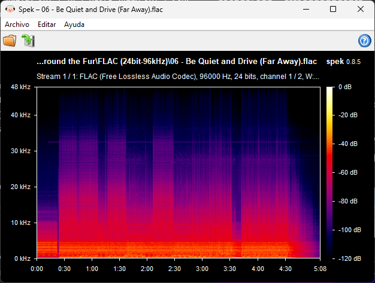
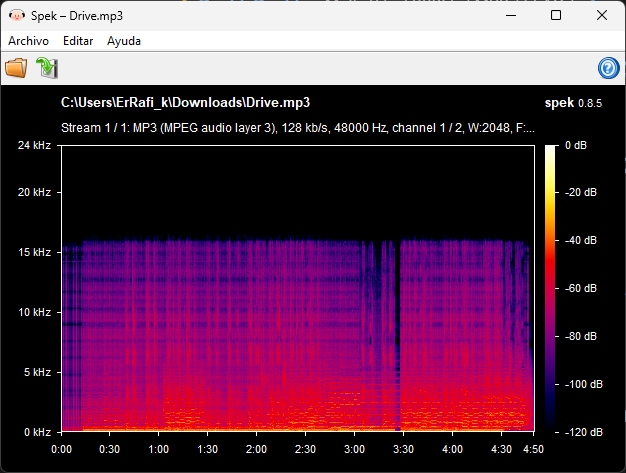

# Configurando descargas FLAC

Este es un tutorial en base de lo que recuerdo de la explicación de [@Ant0wav](https://github.com/Ant0wav) que hicimos llamada el 05/10/2025.

# Índice

- [Configurando descargas FLAC](#configurando-descargas-flac)
- [Índice](#índice)
- [1. Verificar audio FLAC](#1-verificar-audio-flac)
    - [🎧 Referencia rápida de calidad de audio](#-referencia-rápida-de-calidad-de-audio)
    - [🔍 Anotaciones Spek](#-anotaciones-spek)
- [2. Descargar](#2-descargar)
  - [2.1 Qobuz](#21-qobuz)
  - [2.1 Soulseek](#21-soulseek)
    - [2.1.1 SoulseekQt](#211-soulseekqt)
    - [🎛️ Filtros y valores en Soulseek](#️-filtros-y-valores-en-soulseek)
    - [2.1.2 Nicotine+](#212-nicotine)
- [3. MusicBee](#3-musicbee)
- [4. Drivers/share](#4-driversshare)

***
# 1. Verificar audio FLAC
Para verificar que un archivo de audio FLAC no tiene compresión usaremos la aplicación [Spek](https://www.spek.cc/p/download).
Funciona también para ver el audio en videos incluso en .mkv 🤯
🗃️ Para más información sobre este tema dejo [_Dive deeper into the infinite world of lossless audio quality_](https://rentry.co/wheredownloadmusic#dive-deeper-into-the-infinite-world-of-lossless-audio-quality).
### 🎧 Referencia rápida de calidad de audio
| Tipo / Formato      | Bitrate          | Frec.       | Bits | Espectro visible en Spek | Calidad                                           |
| ------------------- | ---------------- | ----------- | ---- | ------------------------ | ------------------------------------------------- |
| MP3 baja (.mp3)     | 96–128 kbps      | 44.1 kHz    | 16   | ~16 kHz                  | <span style="color:red;">Baja</span>              |
| MP3 alta (.mp3)     | 192–320 kbps     | 44.1–48 kHz | 16   | ~19–20 kHz               | <span style="color:orange;">Media</span>          |
| AAC / OGG           | 256–320 kbps     | 44.1–48 kHz | 16   | ~20 kHz                  | <span style="color:gold;">Buena</span>            |
| FLAC / ALAC (CD)    | ~1,000 kbps      | 44.1 kHz    | 16   | Hasta 22 kHz             | <span style="color:limegreen;">Sin pérdida</span> |
| FLAC Hi-Res         | 1,500–3,000 kbps | 48–192 kHz  | 24   | Hasta 24–96 kHz          | <span style="color:green;">Excelente</span>       |
| Streaming / YouTube | 128–160 kbps     | 44.1–48 kHz | 16   | ~16–18 kHz               | <span style="color:gray;">Variable</span>         |

| ✅ Buen FLAC                              | ❌ Falso FLAC                            |
| ----------------------------------------- | ---------------------------------------- |
|  |  |
| Espectro completo (96 kHz)                | Corte a 16 kHz (MP3)                     |
### 🔍 Anotaciones Spek
- **Corte a 16 kHz → archivo con pérdida** (MP3 reempaquetado como FLAC).
- **Hasta 22 kHz → FLAC legítimo de CD.**
- **Más de 22 kHz → audio Hi-Res (24-bit / 96 kHz).**
- **Cortes horizontales** en el espectro = compresión destructiva.
***
# 2. Descargar
¿Cómo y donde descargar estos archivos FLAC? Podemos tener como referencia [Audio Ripping de FMHY](https://fmhy.net/audio#audio-ripping). Pero aquí trataré los que me ha enseñado este tío [@Ant0wav](https://github.com/Ant0wav).
## 2.1 Qobuz
Primero tratamos de encontrar la canción aquí 🕵️
Nos descargamos [QobuzDownloaderX-MOD](https://github.com/DJDoubleD/QobuzDownloaderX-MOD) para descargar las canciones de su [Qobuz Web](https://play.qobuz.com/discover).
Ejecutamos _QobuzDownloaderX.exe_.

Inciamos sesión con los tokens de una cuenta de Qobuz 🪪.

Es darle a buscar y descargar no hay perdida 👍, también se puede buscar en el [Qobuz Web](https://play.qobuz.com/discover) y poner el link.

> [!NOTE]
> Usa [firehawk52]([https://rentry.co/FMHYB64#firehawk](https://rentry.co/FMHYB64#firehawk:~:text=aHR0cHM6Ly9wYXN0ZWJpbi5jb20vQW44NFVqNEQ%3D-,firehawk,-aHR0cHM6Ly9wYXN0ZWJpbi5jb20vUG53OXJFMkQ%3D)).
---

## 2.1 Soulseek

Torrents para música vaya

> Soulseek es un programa y una red de intercambio de archivos informáticos usado primordialmente para compartir música, aunque permite el tránsito de toda clase de archivos.

Hay dos principales interfaces de cliente (aunque existen más, incluso para móvil [Seeker](https://play.google.com/store/apps/details?id=com.companyname.andriodapp1&hl=fr&pli=1)), funcionan sobre el mismo servicio [Soulseek](https://www.slsknet.org/news/node/680), solo que la primera es oficial de código cerrado y la segunda no es oficial pero si es de código abierto.

### 2.1.1 SoulseekQt

Cliente **oficial** de Soulseek, disponible para **Windows**, **macOS** y **Linux**.

Hay filtro, pero es incomodo usando la sección `Search` para encontrar los álbumes, aquí dejo una referencia de las etiquetas "Según chatGPT 🥸" no he comprobado que funcionen xd.

### 🎛️ Filtros y valores en Soulseek

| Etiqueta / Filtro | Valores comunes que puedes usar                     | Descripción breve                                    |
| ----------------- | --------------------------------------------------- | ---------------------------------------------------- |
| `format:`         | `flac`, `alac`, `wav`, `aiff`, `aac`, `ogg`, `mp3`  | Tipo o formato de archivo de audio.                  |
| `bitrate:`        | `128`, `192`, `256`, `320`                          | Tasa de bits (kbps) del archivo, útil para MP3.      |
| `bitdepth:`       | `16`, `24`, `32`                                    | Profundidad de bits (calidad del audio sin pérdida). |
| `samplerate:`     | `44.1`, `48`, `88.2`, `96`, `192`                   | Frecuencia de muestreo en kHz.                       |
| `artist:`         | Nombre del artista o banda (ej. `artist:Radiohead`) | Filtra por .intérprete.                              |
| `album:`          | Nombre del álbum (ej. `album:OK Computer`)          | Filtra por álbum exacto.                             |
| `title:`          | Nombre de la canción (ej. `title:Paranoid Android`) | Busca un tema específico.                            |
| `genre:`          | `rock`, `pop`, `jazz`, `electronic`, etc.           | Filtra por género musical.                           |
| `year:`           | `1997`, `2005`, `2024`, etc.                        | Filtra por año de lanzamiento.                       |
| `label:`          | Nombre del sello discográfico (ej. `label:warp`)    | Filtra por sello o discográfica.                     |
| `country:`        | `us`, `uk`, `jp`, `es`, etc.                        | Busca lanzamientos por país (no siempre funciona).   |
| `ext:`            | `flac`, `mp3`, `wav`, etc.                          | Filtra por extensión de archivo.                     |

💡 **Ejemplo combinado:**

```
artist:Daft Punk album:Discovery format:flac bitdepth:24 samplerate:96
```

<a href="https://www.slsknet.org/news/node/1" target="_blank">
      <button>Descarga aquí 📥</button>
</a>

---

### 2.1.2 Nicotine+

Alternativa **open source** compatible con la red Soulseek.
Ideal para **Linux**, pero funciona en todos los sistemas.

🧠 Ventajas sobre SoulseekQt

- Interfaz más moderna con tema oscuro ✨.
- Soporta plugins, notificaciones del sistema y filtros avanzados.

<br>
<a href="https://nicotine-plus.org/" target="_blank">
  <button>Descarga aquí 📥</button>
</a>

# 3. MusicBee

En progreso 🏗️

# 4. Drivers/share

En progreso 🏗️
